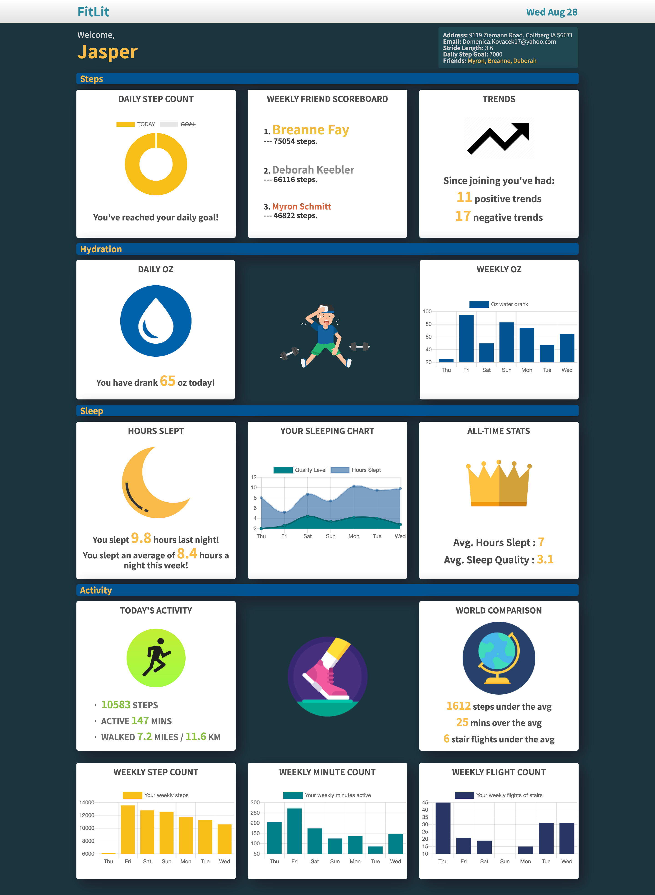

# FitLit Project

## Summary
FitLit is an original activity tracker dashboard similar to Fitbit. For this project, we had access to a large activity tracker dataset from many users over many days. Similarly to how Fitbit devices log data and present it on a dashboard for their users. Our main purpose was to transform all the data into meaningful information for the user, and to display it with an original design for the user to view and see their latest activity stats, goals, and milestones.
The project specs can be found <a href="https://frontend.turing.io/projects/fitlit.html">here</a>. 

### The live page can be accessed <a href="https://edwindelbosque.github.io/FitLit/src/index.html">here</a>.

### Contributors 

## by [Edwin Del Bosque](https://github.com/edwindelbosque) & [Vanessa Randall](https://github.com/vrandall66)

## Goals and Objectives

- We've made a working application meeting the next goals
- Implement ES6 classes that communicate to each other as needed
- Write modular, reusable code that follows SRP (Single Responsibility Principle)
- Implement a robust testing suite using TDD (Test-Driven Development)
- Use of object and array prototype methods to perform data manipulation
- Display information on the page while maintaining ability to test class properties and methods
- Create a data dashboard that is easy to use and displays information in a clear way

## Built With

- **JavaScript ES6**
- **TDD:** Chai & Mocha
- **HTML5**
- **CSS3**

## Screenshots

## Features

- Sample datasets that match the structure of the application data
- Identified by their userID, show the average fluid ounces consumed per day for all time
- Display a user's number of fluid ounces of water consumed for a specific day (any possible day)
- Display how much water was consumed each day over the course of a week
- Display the average number of hours slept per day
- Display average sleep quality per day over all time
- Display number of hours they slept for a specific day (any possible day)
- Display their sleep quality for a specific day (identified by a date)
- Display how many hours slept each day over the course of any given week
- Display sleep quality each day over the course of any given week
- Display the average sleep quality of all users
- Find all users who average a sleep quality greater than 3 for any given week
- Find the users who slept the most number of hours the previous night
- Display the number of miles walked based on their number of steps and stride length
- Display how many minutes they active for any given day
- Display how many minutes active the user averaged for any given week
- Evaluate if the user reached their step goal for any given day
- Display all of the days where they exceeded their step goal
- Find the user's all-time stair climbing record
- Display what is the average number of stairs climbed, steps taken, and minutes active for any given day
- User's can see their friends step count for a whole week in order of who won
- Display which days the user had increasing steps for 3 or more days
- Utilize Chart.js to display data
- ~~Drag-and-drop widgets~~
- ~~Give the user the ability to select the widgets they always want to see at the top of the page and save this customization to Local Storage~~
- ~~Admin view showing all user data and trends~~
