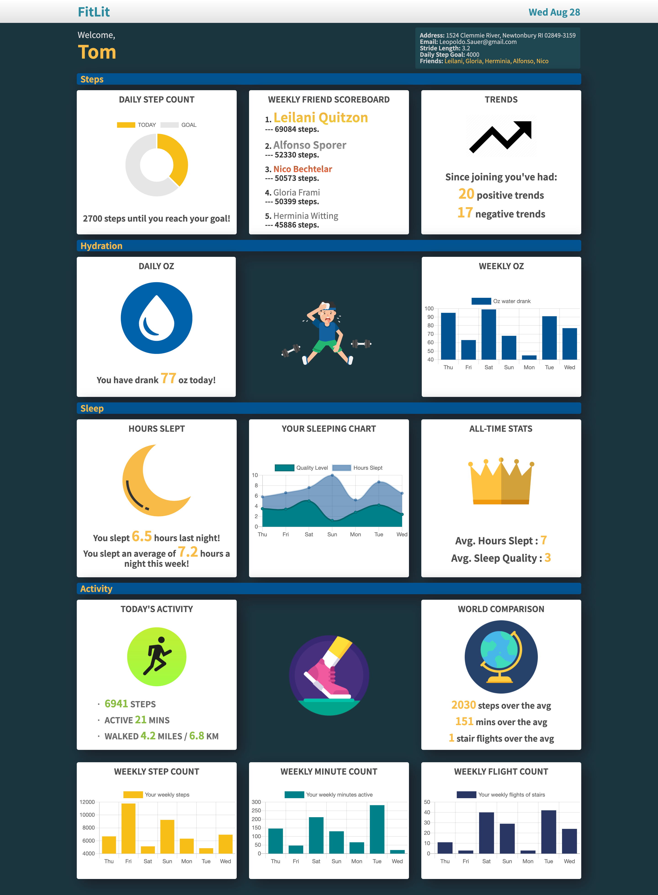

# FitLit Project

## General Info

We were given a dataset from the Mod 2 instructors at Turing and had to take the data and display it in a meaningful way.
The repository can be found <a href="https://github.com/edwindelbosque/FitLit">here</a>. The project specs can be found <a href="https://frontend.turing.io/projects/fitlit.html">here</a>. The live page can be accessed <a href="https://edwindelbosque.github.io/FitLit/">here</a>.

## Contributors 

#### By [Edwin Del Bosque](https://github.com/edwindelbosque) and [Vanessa Randall](https://github.com/vrandall66)

## Goals and Objectives

- Implement ES6 classes that communicate to each other as needed
- Write modular, reusable code that follows SRP (Single Responsibility Principle)
- Implement a robust testing suite using TDD
- Use object and array prototype methods to perform data manipulation
- Display information on the page while maintaining ability to test class properties and methods
- Create a data dashboard that is easy to use and displays information in a clear way

## Built With/Utilizing

- ES6
- Mocha
- Chai
- TDD
- HTML5
- CSS3

## Screenshots

## Features

- [x] Sample datasets that match the structure of the application data
- [x] Identified by their userID, show the average fluid ounces consumed per day for all time
- [x] Display a user's number of fluid ounces of water consumed for a specific day (any possible day)
- [x] Display how much water was consumed each day over the course of a week
- [x] Display the average number of hours slept per day
- [x] Display average sleep quality per day over all time
- [x] Display number of hours they slept for a specific day (any possible day)
- [x] Display their sleep quality for a specific day (identified by a date)
- [x] Display how many hours slept each day over the course of any given week
- [x] Display sleep quality each day over the course of any given week
- [x] Display the average sleep quality of all users
- [x] Find all users who average a sleep quality greater than 3 for any given week
- [x] Find the users who slept the most number of hours the previous night
- [x] Display the number of miles walked based on their number of steps and stride length
- [x] Display how many minutes they active for any given day
- [x] Display how many minutes active the user averaged for any given week
- [x] Evaluate if the user reached their step goal for any given day
- [x] Display all of the days where they exceeded their step goal
- [x] Find the user's all-time stair climbing record
- [x] Display what is the average number of stairs climbed, steps taken, and minutes active for any given day
- [x] User's can see their friends step count for a whole week in order of who won
- [x] Display which days the user had increasing steps for 3 or more days
- [x] Utilize Chart.js to display data
- [ ] Drag-and-drop widgets
- [ ] Give the user the ability to select the widgets they always want to see at the top of the page and save this customization to Local Storage
- [ ] Admin view showing all user data and trends